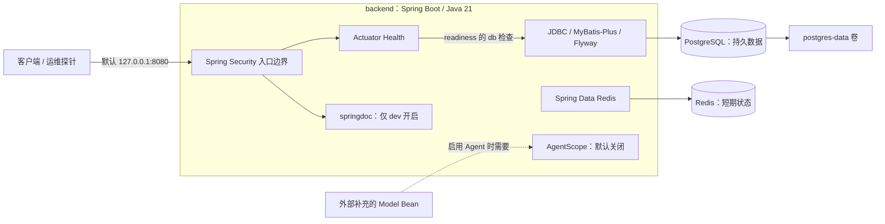

# ToLink vNext 架构总览

> 核对日期：2026-09-15。本文依据当前仓库源码、构建文件及部署配置整理；描述代码现状，不代表本次已执行运行时验收。版本号表示仓库锁定值。

## 1. 项目定位与当前阶段

当前项目是 **ToLink vNext Java 后端基础工程**，采用 COLA Light 风格的分层模块化单体：一个 Maven 模块、一个 Spring Boot 应用、一个后端 JVM 进程，通过 Java 包划分职责。

目前已接入 Web、安全边界、数据库迁移、数据库访问、Redis、健康检查和基础测试。`adapter`、`application`、`domain` 三层仅有 `package-info.java`；运行配置与技术接入主要位于 `infrastructure`。仓库没有前端，也没有业务 Controller、业务用例、业务领域模型或业务表。Identity、FAR、会员、Persona、推荐、工作流等仍未实现。

## 2. 运行结构

图中的数据库、缓存与 Agent 接入是技术基础设施，目前没有业务请求把它们串联成完整业务流程。Compose 运行 `backend`、`postgres`、`redis` 三个服务；AgentScope 位于后端进程内部。

## 3. 分层职责与代码入口

根包：`org.xaspire.tolink`。启动类 [Application.java](src/main/java/org/xaspire/tolink/Application.java) 使用 `@SpringBootApplication` 与 `@ConfigurationPropertiesScan` 完成应用启动和配置属性扫描。

| 包 | 职责 | 当前实现 |
| --- | --- | --- |
| `adapter` | 入站协议、请求转换、边界适配 | 仅包说明，尚无业务 API |
| `application` | 编排用例、协调领域能力与外部端口 | 仅包说明 |
| `domain` | 业务概念、规则及领域端口 | 仅包说明 |
| `infrastructure.configuration` | 类型化配置绑定 | `AgentProperties`、`OssProperties`、`ApplicationSecurityProperties` |
| `infrastructure.security` | HTTP 安全过滤链 | `SecurityConfiguration` |
| `infrastructure.persistence` | 数据库技术接入 | `InfrastructureProbeMapper`，仅执行 `SELECT 1` |
| `infrastructure.agent.agentscope` | 可选 AgentScope 装配 | `AgentScopeConfiguration` |

后续业务应沿用 `adapter → application → domain` 的职责顺序。需要持久化或调用外部能力时，由适当的内层定义端口，`infrastructure` 实现端口，并由 Spring 装配。这是扩展约定，当前没有业务端口或仓储实现。

领域层必须保持技术独立，不依赖 `adapter`、`infrastructure`、MyBatis-Plus、Redis、OSS 或 AgentScope。[ArchitectureTest.java](src/test/java/org/xaspire/tolink/architecture/ArchitectureTest.java) 已声明对应的禁止依赖规则；目前并未为所有层间依赖方向建立完整的自动化约束。

## 4. 数据与外部能力

### PostgreSQL 与 MyBatis-Plus

PostgreSQL 是持久业务事实的存储目标。Spring JDBC 提供数据源和事务能力，MyBatis-Plus 提供 Mapper 接入；Hikari 连接池最大连接数默认为 10，可通过 `DB_POOL_MAX_SIZE` 覆盖。[mybatis-config.xml](src/main/resources/mybatis-config.xml) 开启下划线到驼峰的字段映射。

Flyway 是生产 schema 变更入口，迁移目录为 `src/main/resources/db/migration`，配置的默认 schema 为 `tolink`。当前唯一迁移 [V1__baseline.sql](src/main/resources/db/migration/V1__baseline.sql) 仅执行 `SELECT 1`，没有业务建表语句。

集成测试中的 `integration_probe` 是测试动态创建、结束后删除的探针表，不属于业务模型或生产迁移。

### Redis

通过 Spring Data Redis 接入，定位为缓存及短期状态存储，不承载业务事实。连接和操作超时默认均为 2 秒。Compose 明确关闭 RDB 与 AOF，也没有 Redis 数据卷；当前生产源码尚无业务缓存读写逻辑。

### AgentScope 与 OSS

[AgentScopeConfiguration.java](src/main/java/org/xaspire/tolink/infrastructure/agent/agentscope/AgentScopeConfiguration.java) 仅在 `tolink.agent.enabled=true` 时注册 `ReActAgent`。构建 Agent 需要注入 `Model` Bean，而仓库没有提供真实模型适配配置，因此仅打开开关不足以完成模型接入。当前仅依赖 `agentscope-core`，没有独立 Agent 服务或业务工作流。

OSS 只有属性占位：`enabled`、`region`、`endpoint`。当前没有 OSS SDK 依赖、客户端或上传下载实现；启用属性不等于已有对象存储能力。

## 5. HTTP 安全与可观测性

[SecurityConfiguration.java](src/main/java/org/xaspire/tolink/infrastructure/security/SecurityConfiguration.java) 采用默认拒绝策略：

| 路径 / 能力 | 当前行为 |
| --- | --- |
| `/actuator/health` 及其子路径 | 允许匿名访问；健康详情不对外展示 |
| `/v3/api-docs/**`、`/swagger-ui/**`、`/swagger-ui.html` | 仅当 `tolink.security.permit-api-docs=true` 时放行 |
| 其他请求 | `denyAll` |
| 表单登录、HTTP Basic、Logout | 显式关闭 |
| 默认自动生成用户 | 排除 `UserDetailsServiceAutoConfiguration` |

身份认证、授权规则和业务接口仍需后续实现。新增 Controller 后，还需要同步设计安全规则才能对外开放。

Actuator 的 Web 暴露范围仅为 `health`。`liveness` 只包含 `livenessState`；`readiness` 包含 `readinessState` 与 `db`，明确不包含 Redis。Compose 的后端健康检查使用 liveness，但启动依赖同时要求 PostgreSQL 和 Redis 健康：**运行中的 readiness 判定与 Compose 启动条件不同**。不要将 readiness 的排除规则等同于所有健康端点都忽略 Redis。

## 6. 环境配置与部署

配置集中于 [application.yml](src/main/resources/application.yml)，使用环境变量覆盖连接信息及功能开关。

| 环境 | 配置差异 |
| --- | --- |
| 基础配置 | API 文档关闭；AgentScope、OSS 默认关闭 |
| `dev` | 开启 springdoc，并允许文档路径访问 |
| `prod` | 关闭 springdoc，不放行文档路径 |
| `integration` | 默认连接 Compose 的 `tolink_test` 数据库与 Redis，不放行文档路径 |

[compose.yaml](compose.yaml) 默认使用 `dev`，仅发布后端端口 `127.0.0.1:8080`；PostgreSQL 与 Redis 不发布宿主机端口。PostgreSQL 数据卷挂载至 `/var/lib/postgresql`。本地环境变量模板见 [.env.example](.env.example)，实际 `.env` 不应提交。数据卷提供持久化，备份仍须单独执行，操作示例见 [README.md](README.md)。

[Dockerfile](Dockerfile) 包含三个阶段：`build` 使用 JDK 和 Maven Wrapper 打包，且跳过测试；`test` 执行 `verify -Pintegration`；`runtime` 使用 JRE，以 UID 10001 的 `tolink` 用户运行 JAR。因此普通镜像构建成功不等于测试通过。

### 仓库锁定的技术版本

| 组件 | 版本 | 配置来源 |
| --- | --- | --- |
| Java / Spring Boot | 21 / 3.5.16 | `pom.xml` |
| Maven Wrapper | 3.9.16 | `.mvn/wrapper/maven-wrapper.properties` |
| MyBatis-Plus / Flyway | 3.5.17 / 11.20.3 | `pom.xml`，Flyway 显式覆盖 Boot 管理版本 |
| PostgreSQL / Redis 镜像 | `postgres:18.6` / `redis:8.2.9-bookworm` | `compose.yaml` |
| AgentScope Core / springdoc | 2.0.3 / 2.8.17 | `pom.xml` |
| ArchUnit | 1.5.0 | `pom.xml`，测试依赖 |
| Java 容器镜像 | Temurin `21.0.12_8`，Jammy | `Dockerfile`，JDK 构建、JRE 运行 |

COLA Light 5.0.0 是项目生成来源；当前 POM 没有引入 COLA 运行时依赖。生成记录与技术选型说明见 [technical-baseline.md](docs/technical-baseline.md)。

## 7. 测试结构与验证边界

| 测试 | 已编写的检查 |
| --- | --- |
| `ArchitectureTest` | 领域层对指定技术包与外层包的禁止依赖规则 |
| `AgentScopeCompatibilityTest` | 使用 mock `Model` 构建最小 `ReActAgent`；不调用真实模型 |
| `InfrastructureIT` | Spring 上下文、Flyway 基线、Agent 禁用时无 Bean、MyBatis-Plus 插入与查询、JSONB 写读、事务回滚、Redis SET/GET/TTL/delete |

快速检查使用 `./mvnw verify`；`InfrastructureIT` 由 Maven `integration` profile 下的 Failsafe 执行，需要 PostgreSQL 与 Redis。完整隔离执行方式使用 `compose.yaml` 与 [compose.integration.yaml](compose.integration.yaml) 叠加，具体命令见 [README.md](README.md#testing)。项目没有使用 H2 或 Testcontainers。

`InfrastructureIT` 使用 `WebEnvironment.NONE`，不启动 HTTP 服务，因此这些测试不构成对 HTTP 安全过滤链或健康端点响应的端到端验证。当前也没有业务流程测试。

## 8. 后续开发导航

新增业务时，先在 `domain` 明确业务规则与必要端口，再由 `application` 编排用例、`adapter` 暴露入口、`infrastructure` 实现存储或外部服务。业务 schema 变更应增加新的 Flyway 迁移，并用真实 PostgreSQL/Redis 集成测试验证所用能力。

阅读顺序建议为：本文 → [Application.java](src/main/java/org/xaspire/tolink/Application.java) → [application.yml](src/main/resources/application.yml) → [SecurityConfiguration.java](src/main/java/org/xaspire/tolink/infrastructure/security/SecurityConfiguration.java) → [compose.yaml](compose.yaml) → [InfrastructureIT.java](src/test/java/org/xaspire/tolink/infrastructure/InfrastructureIT.java)。新增业务模块、外部依赖或部署服务后，应同步更新本文的实现状态与运行结构图。
