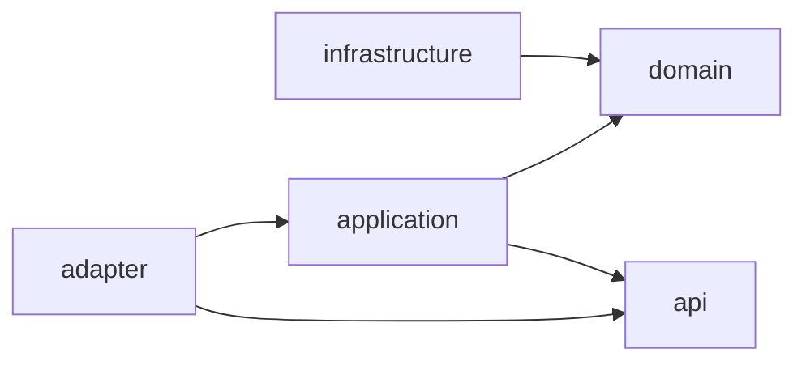

# 架构设计与开发规约

## 1. 模块划分

本工程采用模块化单体架构。业务按领域划分 Maven 模块，领域内部按包分层，最终由一个 Spring Boot 应用运行。

```text
project-bootstrap
    ├── 业务领域模块
    │       └── project-shared
    └── project-shared
```

- `bootstrap`：唯一组合根，负责启动、全局配置和实现选择。
- `shared`：提供通用契约及技术能力，不承载业务服务或领域模型。
- 领域模块：独立维护公开契约、用例、领域规则和技术适配。

【强制】领域模块不得依赖 bootstrap，shared 不得依赖领域模块。领域模块允许通过对方顶层 `api` 协作，禁止形成模块依赖环。

Java 根包为 `org.xaspire.project`。模块使用 `project-<领域名>` 命名，对应包为 `org.xaspire.project.<领域名>`；该约定用于 ArchUnit 识别模块边界。

## 2. 包分层

```text
<领域名>
├── api/{facade,dto,command,query}
├── adapter/{web,mq,job}
├── application/{service,command,query,assembler}
├── domain
│   ├── model/{aggregate,entity,valobj}
│   ├── service
│   ├── repository
│   ├── port
│   └── event
└── infrastructure
    ├── persistence/{mapper,dataobject,repository}
    ├── gateway
    └── client
```

以下箭头表示代码依赖：



| 层 | 职责 | 允许依赖的本模块层 |
| --- | --- | --- |
| `api` | 公开 Facade、DTO、Command、Query | api |
| `adapter` | HTTP、消息及任务入口 | api、application |
| `application` | 用例编排、事务、事件发布及数据转换 | api、domain |
| `domain` | 业务模型、领域规则、仓储和输出端口契约 | domain |
| `infrastructure` | 仓储、输出端口及外部系统适配 | domain |

同层类型可以互相引用。Maven 约束模块依赖，ArchUnit 约束包依赖；单个领域模块的编译路径对其内部各包可见。

### 2.1 领域层

【强制】domain 仅依赖本模块 domain，以及 `java.lang`、`java.util`、`java.time`、`java.math` 包下的 JDK 类型。

禁止引入 Spring、MyBatis、Redis、JPA、HTTP Client 或 shared 技术封装。Repository 与 Port 只定义领域能力，不暴露 SQL、ORM、缓存或厂商 SDK 类型。

### 2.2 公开契约

【强制】api 不得暴露内部模型、持久化对象或技术类型。请求约束可以使用 Jakarta Validation。

同步协作访问对方 api。跨模块事件的消费契约也应在 api 公开，由 application 转换、发布内部 `domain.event`，不得直接引用其他模块的领域事件。

## 3. 组合根与事务

启动类 `org.xaspire.project.bootstrap.Application` 只扫描 bootstrap 包。业务实现通过 bootstrap 的 `@Bean` 或明确的 `@Import` 注册，Mapper 通过 `@MapperScan` 注册。

| 位置 | 注解与注册约束 |
| --- | --- |
| application | 允许 `@Service`、`@Transactional`；实现须由 bootstrap 显式注册，禁止 `@Configuration` |
| domain | 禁止框架注解 |
| infrastructure、shared | 禁止自动组件声明；由 bootstrap 选择实现 |

Spring Boot 在启动模块创建 DataSource、Redis 连接及事务管理器。事务边界归 application，持久化实现归 infrastructure；替换实现时保持领域契约，通过组合根调整实现选择。

## 4. 共享能力

shared 中的响应、异常和 ID 契约使用纯 Java；JSON、Redis 技术包可以依赖相应框架。业务缓存键、数据结构和失效策略归所属领域的 infrastructure。

`RedisLock` 为非重入租约锁，通过 SET NX 与 TTL 获取，释放时以 Lua 校验所有权 token。每次获取使用新 token；无续租及 fencing 能力，调用方须在租期内完成工作。数据库一致性由业务约束和事务保障。

## 5. 数据库迁移

生产 Flyway 由 bootstrap 初始化一次，扫描领域 JAR 中的 `classpath:db/migration`，共用 `public.flyway_schema_history`。

- 【强制】迁移版本在整个仓库内唯一、递增，已应用的迁移不得修改或重用版本号。
- 【推荐】表结构及迁移由所属领域维护，按业务需要划分 schema。
- 空白模板不提供表结构或迁移脚本，业务开发时按需创建。

基础设施测试扫描 `db/integration-migration`，写入 `integration_probe.integration_flyway_schema_history`。测试迁移与业务历史隔离，测试资源不进入运行 JAR。

## 6. 架构检查

| 位置 | 检查范围 |
| --- | --- |
| 领域模块 `ModuleArchitectureTest` | 领域纯净、内部层方向、API 技术类型、跨模块 API |
| bootstrap `ArchitectureTest` | 全部启用模块、shared 方向、组合根及模块依赖环 |
| 对应规则验证测试 | 合法依赖通过，违规依赖被拒绝 |

空模板通过可选层与 `allowEmptyShould(true)` 允许空包。测试夹具仅位于 test；复制模板时一并携带模块内规则和验证测试。

架构参考：[COLA](https://github.com/alibaba/COLA)、[ArchUnit 分层检查](https://www.archunit.org/userguide/html/000_Index.html#_layer_checks)。
