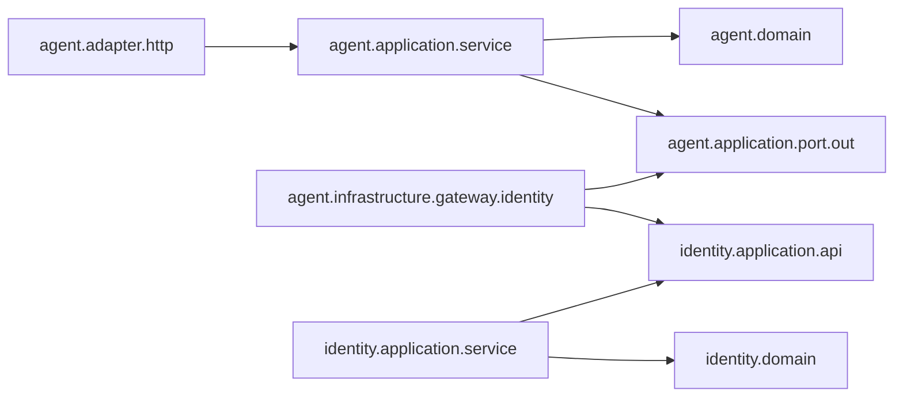

# ToLink：以 COLA 5.0 Light 为基准借鉴小傅哥六边形架构

日期：2026-10-04。当前工程基线：`47da1c4` 与本次工作区。参考：[用户提供的压缩包](</Users/gorwaywong/Downloads/ai-mcp-gateway-main (1).zip>)，内部根目录为 `ai-mcp-gateway-main/`。

**建议保留“一个业务限界上下文一个 Maven JAR，每个上下文内部采用 COLA Light 四层”的组织方式。将小傅哥的 case 职责映射到所属领域的 application，trigger 映射到 adapter，app 的启动装配映射到唯一的 bootstrap；借鉴内层持有接口、外层实现接口的做法，不复制其全局七层模块结构。**

本文是设计建议，不是实施结果。没有修改业务源码、POM、模板或 AGENTS.md，也没有执行压缩包中的脚本、构建或配置。压缩包说明作为参考数据处理。

## 1. 官方基准、项目约束与参考项目，三者要区分

官方 5.0.0 Light 模板采用 `adapter/application/domain/infrastructure`，应用服务协调领域对象/服务和网关，`domain.gateway` 定义出站接口，infrastructure 实现接口。本文以该职责划分为基准。[官方应用服务](https://github.com/alibaba/COLA/blob/v5.0.0/cola-archetypes/cola-archetype-light/src/main/resources/archetype-resources/src/main/java/application/ChargeServiceImpl.java)、[官方 Gateway 接口](https://github.com/alibaba/COLA/blob/v5.0.0/cola-archetypes/cola-archetype-light/src/main/resources/archetype-resources/src/main/java/domain/gateway/AccountGateway.java)、[官方实现](https://github.com/alibaba/COLA/blob/v5.0.0/cola-archetypes/cola-archetype-light/src/main/resources/archetype-resources/src/main/java/infrastructure/AccountGatewayImpl.java)

需要澄清：**“domain 不依赖 Spring”是 ToLink 的更严格项目约定，不是 COLA 5.0 Light 官方模板的绝对禁令。** 官方 `AccountDomainService.java` 第 9、12、15 行使用 Spring `Component` 和 Jakarta `Resource`；`domain/ApplicationContextHelper.java` 也引用 Spring。不能仅凭小傅哥 domain 中出现 `@Service` 就判其违反 COLA。[官方领域服务](https://github.com/alibaba/COLA/blob/v5.0.0/cola-archetypes/cola-archetype-light/src/main/resources/archetype-resources/src/main/java/domain/account/AccountDomainService.java)、[官方上下文帮助类](https://github.com/alibaba/COLA/blob/v5.0.0/cola-archetypes/cola-archetype-light/src/main/resources/archetype-resources/src/main/java/domain/ApplicationContextHelper.java)

ToLink 已明确选择无 Spring、MyBatis、Redis、OSS、AgentScope 的 domain；建议继续保持，以便隔离技术和独立测试。领域对象和服务通过构造参数获得接口依赖，必要的 Spring Bean 创建放在 infrastructure.configuration；不需要为了贴近示例放宽此约束。[当前约定](/Users/gorwaywong/Projects/codeup/tolink/docs/architecture.md:38)

官方 Light 的 `CleanArchTest` 规则体还是注释状态，不能把模板视为完整、自动强制执行的认证规范。应以分层职责、向内依赖与当前团队明确的边界测试共同判断；本文后续更细的分包属于推荐方案。[官方架构测试](https://github.com/alibaba/COLA/blob/v5.0.0/cola-archetypes/cola-archetype-light/src/main/resources/archetype-resources/src/test/java/CleanArchTest.java)

## 2. 压缩包实际上怎样组织

对全部 8 份 POM 与 206 个生产 Java 文件（含 32 个 package-info）进行了模块、包和引用扫描，并阅读代表性的 SSE 用例、领域端口和仓储实现。压缩包有 522 个条目，解压大小约 1 MB。本次没有逐项审计所有业务规则、前端、SQL 或部署配置。

其根 reactor 按技术职责分成七个模块：

| xfg 模块 | 实际职责 | 在 ToLink 中的对应位置 |
| --- | --- | --- |
| `ai-mcp-gateway-trigger` | HTTP 入口、监听器等入站触发 | 所属业务模块的 adapter |
| `ai-mcp-gateway-case` | 用例编排、流程节点与策略路由 | 所属业务模块的 application |
| `ai-mcp-gateway-domain` | auth/session/gateway/protocol/llm/admin 等领域子包、模型、服务、出站接口 | 分析业务边界后，分配到各业务模块的 domain；子包不自动等于独立限界上下文 |
| `ai-mcp-gateway-infrastructure` | 实现端口、访问 DAO/Redis/HTTP | 各业务模块自己的 infrastructure |
| `ai-mcp-gateway-app` | Spring Boot 入口、配置、最终装配 | 唯一的 tolink-bootstrap，加上按归属分配的领域专属配置 |
| `ai-mcp-gateway-api` | 对外接口和 DTO，也包含 HTTP/响应式技术类型 | 根据契约用途放入 adapter 或 application.api，无需独立全局 API JAR |
| `ai-mcp-gateway-types` | 常量、枚举、异常等公共类型 | 多数回所属业务模块；真正稳定且领域无关的契约才进入 shared |

其主要 Maven 关系为：app→trigger/infrastructure，trigger→api/domain/case/types，case→domain/api，infrastructure→domain/types，domain→types。它是按层组织的多模块工程；不能原样用于“每个业务上下文一个模块”的目标。

### 代表链路：MCP SSE 会话创建

压缩包内路径以下省略根目录；行号来自本次读取：

| 步骤 | 代码证据 |
| --- | --- |
| HTTP 入口接收连接并调用 case | `ai-mcp-gateway-trigger/src/main/java/cn/bugstack/ai/trigger/http/McpSSEGatewayController.java:50–61` |
| case 建立流程上下文并启动处理链 | `ai-mcp-gateway-case/src/main/java/cn/bugstack/ai/cases/mcp/sse/session/McpSSESessionService.java:28–36` |
| 鉴权节点调用 auth 领域能力 | 同模块 `cn/bugstack/ai/cases/mcp/sse/session/node/VerifyNode.java:30–44` |
| 会话节点调用 session 领域能力 | 同模块 `cn/bugstack/ai/cases/mcp/sse/session/node/SSESessionNode.java:28–37` |
| 领域定义会话出站接口 | `ai-mcp-gateway-domain/src/main/java/cn/bugstack/ai/domain/session/adapter/port/ISessionPort.java:17–64` |
| 基础设施实现接口并使用 Redis/HTTP 技术 | `ai-mcp-gateway-infrastructure/src/main/java/cn/bugstack/ai/infrastructure/adapter/port/SessionPort.java:17–20、48` |

值得学习的是“用例步骤与领域规则分开、领域通过自有接口访问外部能力”。如果 auth 与 session 只是同一限界上下文的内部能力，所属 application 可协调它们；如果二者被定义为独立上下文，则改为通过公开应用契约协作，而不是直接引用对方 domain。不能从包名直接认定它们必须拆开。

## 3. 每个业务模块一个领域，其他层应怎样放

这里建议把“领域模块”精确理解为**业务限界上下文模块**，而非每个实体、聚合或技术组件都创建一个 JAR。bootstrap、shared、父 POM 是支持结构，不需要被解释为业务领域。

```text
tolink/
├── pom.xml
├── tolink-bootstrap/          唯一启动入口与全局运行装配
├── tolink-shared/             必要的稳定公共契约，保持很小
├── tolink-agent/              一个业务上下文，内部完整四层
├── tolink-<业务上下文>/        按真实需求加入，同样内部四层
└── templates/domain-module/   可复制模板，不参与默认 reactor
```

每个上下文内部，adapter、application、domain、infrastructure **都是包层，而非再拆出来的 Maven 模块**。不新建全局 `tolink-domain`、`tolink-case` 或 `tolink-infrastructure` 去容纳所有上下文的代码。

### 编排、领域服务与装配的职责

| 所处理的问题 | 归属 | 判断方式 |
| --- | --- | --- |
| HTTP/消息/定时任务如何进入系统 | adapter | 请求绑定、协议转换、消息解码、调度入口 |
| 一个用例先做什么、再做什么 | application | 调用领域行为、使用出站接口、控制用例事务、返回结果 |
| 业务条件与不变量是什么 | domain | 实体/聚合行为、值对象规则、领域服务；不处理 HTTP 请求 |
| 如何保存、调用 SDK、访问其他系统 | infrastructure | 实现内层接口，处理数据库和技术转换 |
| 哪些对象被创建、连接与运行参数如何装配 | bootstrap / infrastructure.configuration | 全局配置归 bootstrap，领域专属 Bean 与厂商配置归该领域 infrastructure |

**xfg 的 case 对应 COLA 的 application，不额外增加一个“领域编排层”。xfg 的 app 对应 ToLink 的 bootstrap，不能把它误认为 application 用例层。**

application 可以直接调用本上下文的实体/聚合、领域服务和 domain.gateway；不要求所有业务行为先经过一个 DomainService。仅当规则不自然属于某个实体/值对象时再建立领域服务。

## 4. 推荐分包：借鉴模型组织，保留 COLA 四层

下面是按需生长的参考目录，不要求立即创建全部空包、接口和 DTO，也不要求所有业务对象都使用某个固定后缀。

```text
org.xaspire.tolink.agent
├── adapter
│   ├── http                    Controller、Web 请求/响应、协议转换
│   ├── message                 消息入站
│   └── job                     定时任务入口
├── application
│   ├── api                     面向其他上下文的窄公开契约及契约类型
│   ├── service                 用例实现，对应 xfg case 的编排职责
│   ├── dto                     内部用例输入/输出，确有差异时才独立
│   └── port
│       └── out                 用例编排所需的出站接口
├── domain
│   ├── model
│   │   ├── aggregate           真实聚合，存在聚合边界时才建立
│   │   ├── entity              有标识和生命周期的实体
│   │   └── valueobject         按值相等、表达业务概念的值对象
│   ├── service                 领域规则与策略
│   ├── gateway                 Repository、外部领域能力的内层接口
│   └── event                   领域内部事件
└── infrastructure
    ├── persistence
    │   ├── repository          实现 domain.gateway 中的仓储接口
    │   ├── mapper              MyBatis Mapper
    │   └── po                  数据库持久化对象
    ├── gateway
    │   ├── agentscope          厂商适配，沿用已有分包也可以
    │   └── <外部上下文>         实现调用方端口，适配对方 application.api
    └── configuration           领域专属装配和配置属性
```

小傅哥的 `model/entity/valobj/aggregate` 可以借鉴；`valobj` 与 `valueobject` 是命名选择，COLA 没有要求必须采用其中一种。领域内部还可以按内聚业务能力分子包。选择依据是代码规模和领域语义，不是追求与参考项目目录完全相同。

**不建议直接复制 `domain.adapter.repository`、`domain.adapter.port` 或 `infrastructure.adapter.repository`。** 这些名称在参考项目表达出站适配，但 ToLink 当前 `..adapter..` 模式会把嵌套 adapter 也视为入站层，导致误分类甚至触发禁止依赖规则。采用 `domain.gateway` 与 `infrastructure.persistence/gateway` 可表达相同职责，也贴近官方 Light。[当前规则](/Users/gorwaywong/Projects/codeup/tolink/tolink-bootstrap/src/test/java/org/xaspire/tolink/architecture/ArchitectureTest.java:25)

这是当前规则与包名的具体兼容性问题，不是“COLA 官方禁止任何嵌套 adapter 包”。后续架构测试宜按“上下文后的第一层包”识别层级，以免同名内部包被误判。

## 5. 领域端口与应用端口，不需要机械建立两套

| 能力由谁需要 | 接口归属 | 实现归属 |
| --- | --- | --- |
| 领域模型需要聚合持久化或领域相关外部能力 | 本上下文 domain.gateway | 本上下文 infrastructure |
| 应用用例需要跨上下文查询、通知或其他编排能力 | 本上下文 application.port.out | 本上下文 infrastructure |
| 本模块向其他上下文提供能力 | 本上下文 application.api | 本上下文 application.service |
| HTTP 协议入口 | adapter.http | 调用应用层，不绕过应用层访问领域 |

官方 Light 将 Gateway 定义在 domain，应用服务也可直接使用它。`application.port.out` 是 ToLink 的扩展约定，不是为了“六边形”必须补出的第二套领域 Gateway；同一能力选一个合适归属即可。[官方应用服务与网关使用](https://github.com/alibaba/COLA/blob/v5.0.0/cola-archetypes/cola-archetype-light/src/main/resources/archetype-resources/src/main/java/application/ChargeServiceImpl.java)

`application.api` 可以同时作为明确公开的入站用例接口，不必再增加完全相同的 `port.in` 接口和一层 Facade 转发。只有外部公开契约与内部用例契约实际不同，才分别建模。

domain 不依赖 application.port.out；否则接口虽叫 Port，依赖方向仍然反了。DTO 和端口签名应使用所属内层的自有类型，不能以 `ReActAgent`、`ChatModel`、MyBatis PO 或 HTTP `ResponseEntity` 作为领域契约。

## 6. 跨领域编排的两种归属

### 默认：归到发起业务用例所属上下文

如果用例是某上下文自身的业务能力，只是需要其他上下文协助，编排放在该上下文的 application。调用方可以先定义自己的出站端口，再由自己的 infrastructure 适配对方的 application.api。

例如，一个 agent 用例需要身份领域确认访问资格。下图是**编译依赖**，接口实现的箭头向接口指，不是运行时调用时序；对象名仅为位置示意，不是本次新增功能。



运行时：agent 用例调用自己的接口，Spring 装配的实现调用 identity 的公开 API，identity 应用服务调用自己的 domain。双方实体、仓储、Mapper 和 PO 不跨边界传播。编译依赖可以是 `tolink-agent → tolink-identity`，但用 ArchUnit 限定只访问其 application.api，避免因同一个 JAR 暴露所有 public 类就误用内部实现。

对于稳定、简单的同步调用，当前项目约定允许 application 直接引用对方 application.api；不必为每个调用强制建立防腐层。涉及对方类型转换、协议差异、变化频繁或需测试替身时，调用方 Port + infrastructure 适配更合适。无论采用哪种方式，都不得形成双向模块依赖。

### 按需：真正有独立业务状态的流程上下文

如果流程自身有明确业务语言、长期状态、生命周期、规则、补偿或审计要求，可以考虑独立流程上下文；其中 application 协调其他上下文，domain 保存流程自己的模型与规则。

这可以是未来的 `tolink-workflow`，但当前仅凭“流程涉及多个领域”还不足以创建它。文档虽列出 workflow 为未来领域，并没有实际模型或用例，应继续按需加入。[未来领域](/Users/gorwaywong/Projects/codeup/tolink/docs/architecture.md:26)

不要建立一个没有业务模型、包揽所有用例的全局 `tolink-case`/`tolink-application`，也不要把编排放进 bootstrap。需要共享流程能力时，先明确流程所属业务与依赖图，而不是先制造新的中心模块。

## 7. 基础设施与 app 的具体归属

| 内容 | 推荐归属 |
| --- | --- |
| Spring Boot 入口、全局连接池、全局 Security、Actuator、Flyway 初始化 | tolink-bootstrap |
| 领域专属 Mapper/PO、Repository 实现、缓存键与策略 | 所属业务模块 infrastructure |
| AgentScope/OpenAI/OSS 等业务调用适配 | 使用该能力的业务模块 infrastructure |
| 领域对象和领域服务的 Spring Bean 创建 | 所属模块 infrastructure.configuration；domain 保持纯 Java |
| DataSource/Redis 连接对象等技术底座 | 全局装配可以在 bootstrap，领域适配器通过注入使用 |
| 领域表迁移 | 所属业务 JAR 的 resources/db/migration；全局由 bootstrap 初始化一次 |
| 真正多上下文通用的稳定契约 | shared；业务规则和通用技术客户端不因“共享”就迁入这里 |

当前 AgentScope 装配已在 agent.infrastructure 内，方向合适，不必为了采用新目录把它机械搬到 `infrastructure.gateway.agentscope`。[已有装配](/Users/gorwaywong/Projects/codeup/tolink/tolink-agent/src/main/java/org/xaspire/tolink/agent/infrastructure/agentscope/AgentScopeConfiguration.java:10)

单领域 JAR 的 POM 中存在 Spring/SDK 依赖，是为其 infrastructure 服务；并不意味着 domain 已引用这些类型。Light 的领域纯净性仍靠代码依赖和架构测试保护。

## 8. 从参考项目选择性学习

| 做法 | 结论 |
| --- | --- |
| 领域拥有 Repository/Port，infra 实现并转换数据 | 直接借鉴；用 domain.gateway 等包名表达 |
| entity/valueobject/aggregate 分类 | 按真实业务借鉴；不按目录创建空聚合、伪值对象 |
| case 中明确步骤、策略、上下文 | 编排职责迁入 application；复杂流程才采用节点/策略模式，简单用例用普通方法即可 |
| trigger/case 分开 | 保留职责分离，落到 adapter/application |
| 全局七层 Maven 模块 | 不采用；与“每业务上下文一个模块”的组织目标不同 |
| domain 直接构造厂商模型、持有 WebFlux 流 | 不照搬到 ToLink；自有类型留内层，技术适配归外层 |
| global api/types | 不整包移植；HTTP 契约、上下文公开契约、领域类型各归其所有者 |
| 聚合目录说明 | 不能作为实际聚合代码范例；压缩包相关 aggregate 目录仅有 package-info |

具体边界证据：`domain/llm/service/ILLMService.java:4、24` 导入并返回 Spring AI `ChatModel`；`domain/session/model/valobj/SessionConfigVO.java:7–8、33` 持有 `Sinks.Many<ServerSentEvent<String>>`。它们将厂商/传输类型纳入领域契约，不适合 ToLink 当前约束。SSE 帧、HTTP headers、连接 sink 归 adapter；应用层管理业务会话生命周期与协作用例，domain 保留会话标识、状态和规则。

同样，参考项目名为 VO 的类不一定都满足值对象的相等性、不可变性和业务语义要求；CommandEntity 也不能仅凭后缀认定为 DDD 实体。应按业务身份和行为判断，不复制命名习惯来代替建模。

## 9. 当前工程需要的最小调整

不需要结构性重建。建议实施时按以下顺序收敛：

1. 保留四层与一个上下文一个 JAR，修正文档中的旧模块目录和模板父 POM 路径。
2. 明确 application 为用例编排层，domain.gateway 保存领域需要的接口，infrastructure 保存实现，bootstrap 只装配；修正模板中 Repository/Gateway 接口与实现未区分的说明。
3. 补全 domain→application 禁止、领域→bootstrap 禁止、shared 独立、未知包归层、跨领域公开契约和无环规则；领域纯 Java 标明为团队加严约定。
4. 以真实 agent 用例逐步增加模型、用例和端口，不提前创建所有参考目录，也不新增全局 case/app/infrastructure 业务模块。

前次团队审查发现的 Docker 路径与 CI 接入问题仍需解决，与本次包结构选择无冲突；详见[团队骨架审查](/Users/gorwaywong/Projects/codeup/tolink/plans/team-skeleton-review.md)。本次未重复运行测试，未做重构。

最终推荐是：**业务边界按上下文纵向划分，内部职责按 COLA Light 四层划分，技术依赖通过内层端口向内倒置。学习参考项目的职责和依赖关系，保留 ToLink 的领域隔离与更严格的领域纯净性。**
